# Projeto A1 - Curso Ciências da Computação - Materia Pensamento Computacional
Integrantes do projeto
- **Suelen Marinho:** RGM: 31923160
- **Lelton Borges:** RGM: 27933091

## 1.Introdução

De acordo com Jeannette M. Wing(2006) o pensamento computacional é baseado em poder e limites dos processos da computação independentes se forem executados por um humano ou máquina, ele permite a coragem para resolver problemas que não é possível resolver. Ela afirma também que não só cientistas informáticos podem ter a capacidade do pensamento computacional, mas qualquer um. O entendimento dessas afirmações é entendida que pode resolver e identificar problemas utilizando métodos da ciência da computação e obter resultados. 
Em 2007, Wing em uma apresentação sobre o PC, afirmou que este processo está revolucionando áreas como estatísticas, biologia, economia, química, física, neurociência, geologia, astronomia, matemática, todas as engenharias, direito, medicina, entretenimentos e educação. Defendendo que a metodologia não é apenas para os pesquisadores ou cientistas, mas para todos, listando uma série de vantagens dessa abordagem.
O PC não requer codificação e pode ser realizada completamente desplugada, concentrar esforços no desenvolvimento do pensamento lógico e no pensamento que se baseia na resolução de problemas, proporcionando perguntas que podem lhe dar algumas ideias ou alternativas. Para Nick Pinder, gerente de projetos da metodologia e projetos de ensino superior no ISTE (Sociedade Internacional de Tecnologia na Educação), defende que, da mesma maneira que a tecnologia é utilizada, o pensamento computacional pode ser aplicado em qualquer área do conhecimento.
A sociedade está cada vez mais conectada no qual exige cuidados especiais com a segurança digital. Com isso, o uso de senhas fortes é importante para proteger informações pessoais ou até mesmo no meio corporativo contra acessos não autorizados. De acordo com um relatório da empresa de segurança SpyCloud, analisado pelo site Olhar Digital (2021), mesmo com constantes alertas de especialistas, o uso de senhas fracas e o hábito de reutilizá-las em diferentes serviços ainda são práticas comuns entre os usuários.
O objetivo deste trabalho é demonstrar como o pensamento computacional pode ser usado para desenvolver um gerador de senhas seguras, desafios, limites e o impacto sobre essa prática.

## 2.Aplicações do Pensamento Computacional
Nos dias atuais, a metodologia pode ser aplicada em diferentes contextos, por exemplo, na escola, pode-se criar um cronograma de estudos automatizado, com regras e horários. Na saúde, no monitoramento de sintomas e analisar informações básicas. Na agricultura, é possível programar sensores de irrigação com base na umidade do solo, de forma automática. E na vida cotidiana, pode-se planejar uma viagem utilizando algoritmos de análises de passagens, clima, roteiros e o custo.
Desta forma, podemos confirmar sua aplicação em diversos meios. Para esta solução, será abordado um gerador de senhas, aderindo aos pilares do pensamento computacional.

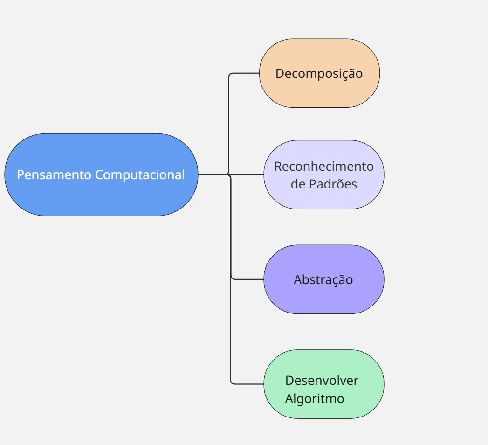

- Decomposição(dividir o problema): O problema foi dividido em etapas: solicitar o tamanho da senha, validar tamanho mínimo, gerar caracteres aleatórios e garantir que não tenha senhas repetidas.
- Reconhecimento de Padrões(Encontrar padrões):Observar que senhas fortes seguem as seguintes características: maiúsculas, minúsculas, números e símbolos. O código segue essas características.
- Abstração(focar no essencial):Aqui o foco não está em caracteres específicos mas sim em garantir que a senha seja forte.
- Desenvolver Algoritmo(criar sequência de passos lógicos):Foi elaborado um algoritmo que gere senhas aleatórias, sem repetição, e que tenha combinações que fazem dela uma senha forte conforme as características necessárias para garantir maior segurança na senha.

## 3.Limitações e Desafios
Apesar de toda eficiência do pensamento computacional para geração de senhas segura existem seus desafios e limitações, como por exemplo: 
- Desafios humanos: Mesmo tendo muitas orientações em ter senhas fortes, muitas pessoas preferem senhas fáceis por serem mais fáceis de memorizar.
- Limitações do pensamento computacional: Por mais que essa técnica seja útil para gerar senhas fortes, não impede dos ataques cibernéticos ou vazamentos de dados
- Expiração de senhas: É de suma importância em sistemas críticos, que existam políticas para forçar os usuários a trocarem suas senhas em intervalos regulares. Isso dificulta ainda mais que supercomputadores decodifiquem senhas antigas com base no hash atual.

## 4.Metodologia

Este projeto foi desenvolvido com o intuito de aplicar os conceitos do pensamento computacional, a fim de demonstrar a implementação de um gerador de senhas segura. A metodologia é de natureza prática e exploratória, uma vez que se busca entender os princípios do pensamento computacional para resolver o problema e uma solução que pode ser aplicada para o problema real. Foi utilizado o ambiente de desenvolvimento Dev C++, a linguagem C++, foi escolhida pela capacidade de manipular os dados de forma rápida e pelo controle dos processos de geração de strings e a aleatoriedade que as senhas precisam ter.
Etapas para o desenvolvimento:

1.Qual é o problema?
A necessidade de criar um gerador de senhas que produza uma senha forte, tenha letras maiúsculas, minúsculas e símbolos e garantir que não se repitam. 

2.Desenvolvimento:

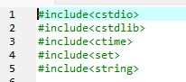

As bibliotecas são necessárias para entrada e saída de dados, gerar os números aleatórios, trabalhar com as strings e armazenar as senhas geradas para que não se repitam.

Aqui estão declarados os caracteres possíveis para gerar as senhas e que são critérios para senhas fortes

Calcula quantos caracteres há no vetor

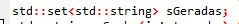

Essa declaração vai fazer com que guarde as senhas já criadas usando de a estrutura set

armazena o tamanho da senha

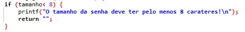

Se o usuário informar que quer uma senha menor que 8, o programa exibe o aviso e retorna uma string vazia não gerando uma senha.

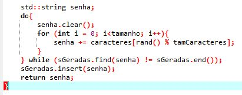

Aqui no corpo dessa função é possível,o senha.clear() limpa a variavel senha antes de gerar uma outra nova, o foor para cada posição da senha escolhe aleatoriamente um caractere para o vetor caracteres, o do , while faz com que essa geração se repita caso já exista a senha.

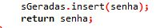

Armazena a senha para evitar repetições

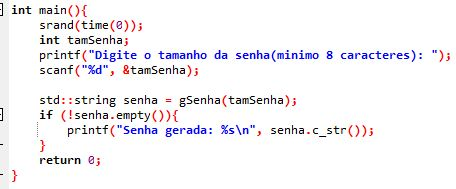

Explicando a função principal, é onde a execução do programa acontece. 
srand(time(0)); onde é gerado os números aleatórios diferentes em cada execução.

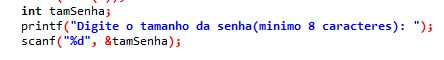

Aqui o usuário informa o tamanho desejado e tem informado que o tamanho mínimo é 8

A função gSenha(int) cria uma senha para o tamanho informado de forma aleatória

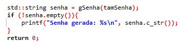

3.A senha foi gerada corretamente? Se sim, imprime na tela e fim.
Testes e validações: 
Para senhas menores que 8:

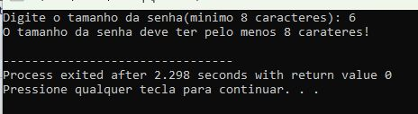

Senha gerada corretamente e com todos criterios de uma senha forte: 

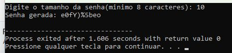

Foi solicitado o mesmo tamanho anterior e não gerou a mesma senha:

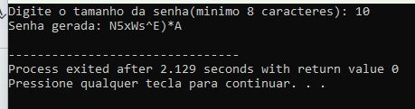

4.Fluxograma:
O fluxograma abaixo explica como programa funciona: 

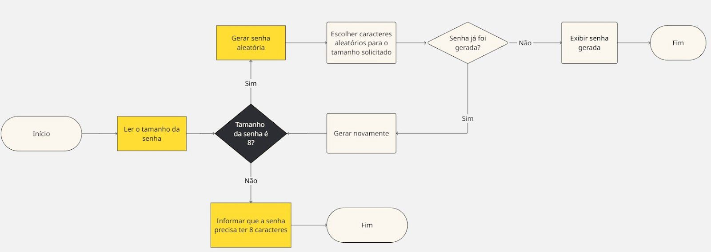

## 5.Resultados e Discussão
O gerador desenvolvido foi capaz de gerar senhas fortes utilizados os critérios necessários, sendo eles:
Letras maiúsculas
Letras minúsculas
Símbolos
Números
Ter no mínimo 8 caracteres 
O gerador consegue fazer essas combinações e permite que o usuário escolha um tamanho superior a 8 caracteres. 
O algoritmo é eficiente e simples, o usuário pode ter desafios para memorizar as senhas geradas e a solução seria usar um gerenciador de senhas e autenticação de dois fatores para melhorar a segurança.

## 6. Conclusão
Este trabalho mostra como as técnicas do pensamento computacional pode
ser aplicado para resolver problemas, como na geração de senhas seguras. Podendo desenvolver uma solução para atender a necessidade prática da segurança digital.
Contudo, foi evidenciado que com os avanços tecnológicos não é suficiente para resolver todos os desafios relacionados à segurança da informação, a proteção digital é necessário aplicar boas práticas, protocolos de segurança e conscientizar usuários sobre riscos e cuidados necessários. 
Para melhoria, pode ser aplicado o desenvolvimento de ferramentas com interfaces mais amigáveis e integrar a autenticação de dois fatores para trazer mais benefícios para essa aplicação.

## Referências:
WING, J. M. Computational Thinking. Communications of the ACM, v. 49, n. 3, p. 33-35, 2006.
OLHAR DIGITAL. 60% das pessoas reutilizam senhas fracas, diz empresa de segurança. Olhar Digital, 4 mar. 2021. Disponível em: https://olhardigital.com.br/2021/03/04/seguranca/60-das-pessoas-reusam-senhas-fracas-diz-empresa-de-seguranca/. Acesso em: 28 maio 2025.

